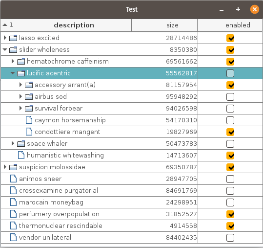

# TreeTable

Treetable displays a tree of information, with additional columns for each item in the tree, in a standard Java Swing `JTable`.



### Software status
This software is still in **alpha**.  It may change unexpectedly at any time.
The parts that are implemented seem to work OK, but we have no unit tests.


## Getting started

### The object
We'll start with the object whose values you want to display in a tree table.  For example:

```java
   public class MyObject {
       private String description;
       private Long size;
       private Boolean enabled;
       private List<MyObject> children;
       ...
   }
       
```

### The model
First we need to subclass a `TreeTableModel`, which defines how to map a table to the `MyObject` class.  

```java
   public class MyObjectTreeTableModel extends TreeTableModel {
   
      private static final int NUM_COLUMNS = 3;
   
      public MyObjectTreeTableModel(TreeTableNode rootNode, boolean showRoot) {
          super(rootNode, NUM_COLUMNS, showRoot);
      }
   
      @Override
      public Object getColumnValue(TreeTableNode node, int column) {  
          MyObject myObject = (MyObject) node.getUserObject();
          switch (column) {
             case 0: return myObject.getDescription();
             case 1: return myObject.getSize();
             case 2: return myObject.getEnabled();
          }
         throw new IllegalArgumentException("Invalid column: " + column);
      }

      @Override
      public void setColumnValue(TreeTableNode node, int column, Object value) {
          MyObject myObject = (MyObject) node.getUserObject();
          switch (column) {
            case 0: {
                myObject.setDescription((String) value);
                break;
            }
            case 1: {
                myObject.setSize((Long) value);
                break;
            }
            case 2: {
                myObject.setEnabled((Boolean) value);
                break;
            }
            default: {
                throw new IllegalArgumentException("Invalid column: " + column);
            }
         }
      }

      @Override
      public TableColumn getTableColumn(int column) {
          switch (column) {
             case 0: return createColumn(0, "Description");
             case 1: return createColumn(1, "Size");
             case 2: return createColumn(2, "Enabled");
          }
          throw new IllegalArgumentException("No column exists for " + column);
      }
      
   }
```

### Displaying the tree
To display a `TreeTableModel`, instantiate a model with a root node, and bind it to a standard `JTable`:

```java
   JTable table = ... 
   MyObject myObject = new MyObject("First root", 10000L, true);
   TreeTableNode root = new TreeTableNode(myObject, true);
   TreeTableModel model = new MyObjectTreeTableModel(root, true);
   model.bindTable(table);
```


## Building a tree

In the example above, we built a single root node and displayed it, so only a single row would be displayed.  You must create the `TreeTableNode` structure, and assign the correct user objects to the nodes.  There are at least two ways to do that:

### Statically building a tree
If your objects already have a tree structure, you can build a mirrored tree of TreeTableNodes from them using the static utility method `TreeTableNode.buildTree()`.  For example:
```java
   MyObject rootObject = yourMethodToGetAnObjectTree();
   TreeTableNode rootNode = TreeTableNode.buildTree(rootObject, parent -> ((MyObject) parent).getChildren());
```
You must supply the root object of the tree, and a lambda, or a class implementing `ChildProvider`, that returns a list of child objects from a parent object, and a `TreeTableNode` will be returned which is the root node of an identical tree of TreeTableNodes.

### Dynamically building a tree
You can dynamically build nodes on expand, or remove them on collapse, by implementing the `TreeTableEvent.Listener` and responding to expand or collapse events.

If on dynamic expand there are no child nodes to be added, you can set the node to not allow children `node.setAllowsChildren(false)` in the tree event.  The node will no longer display expand or collapse handles.

## The tree column
The tree column is the column in which the tree structure is rendered.

### Expanding and collapsing nodes
Selected nodes can be expanded or collapsed by clicking to the left of the expand handle, or via the keyboard with the `+` and `-` keys.  The keys to use are configurable by calling `model.setExpandChar()` and `model.setCollapseChar()`.  You can set them both to be the same char if you prefer, e.g. space bar toggles expand/collapse.

When a node expands or collapses, it fires a `TreeTableEvent`, which you can subscribe to.  A listener has the option of cancelling the event.  It is allowed to make modifications to the tree structure for the node being processed and any of its children.  It must not modify other areas of the tree.

### Icons
To supply icons for nodes in the tree column, override `TreeTableModel.getNodeIcon(node)`. 

### Column

The column which renders the tree defaults to the first column.  This can be changed by calling `model.setTreeColumn(columnIndex)` to the model index of the tree column in which the tree should appear.

## Rendering

### Tree column
By default, the tree column uses a `TreeTableCellRenderer`.  You can use a different renderer (or a subclass) if you prefer, by specifying the renderer to use when you create the TableColumns in the `model.getTableColumn()` method.  TableColumns let you set the cell renderer and the cell editor to use for that column.

If implementing a different tree renderer, you should also implement a `TreeClickHandler` which determines whether a click in this column is an expand or collapse event.  Then set the `TreeClickHandler` using `model.setTreeClickHandler()`

In general, you probably don't want to implement your own tree renderer from scratch, unless there is something particularly unusual.  You can easily subclass the `TreeTableCellRenderer` to add different formatting, and return your subclassed renderer in the appropriate TableColumn.

### Other columns
If you do not specify TableCellRenderers for each TableColumn in `getTableColumn()`, then the JTable will just use a default Object renderer for each column, which calls toString().  To make the JTable use better renderers appropriate to the type of the column, you can override the `TableModel.getColumnClass()` method:
```java
    @Override
    public Class<?> getColumnClass(final int columnIndex) {
        switch (columnIndex) {
            case 0: return String.class;
            case 1: return Long.class;
            case 2: return Boolean.class;
        }
        return Object.class;
    }

```
JTable has built-in TableCellRenderers for Object (including String), Boolean, Number, Float, Double, Icon, IconImage and Date. 

### Table headers
By default, a `TreeTableHeaderRenderer` is used to render the table header.  This displays multi-column sorts by adding the number of the sort column as well as the ascending/descending icons.

You can use a different header renderer if you like - just use one of the `bind()`  methods that lets you specify an alternative header renderer, or set it yourself on the `JTable` directly.  The header renderer has no knowledge that there is a tree being rendered.

## Sorting
Sorting is enabled by default, giving a multi-column sort (up to three columns). 

### Column sorting
For each column that sorting is defined on, the following comparators will be used on the column values in this precedence order:
1. Custom comparator, if defined.
2. Compared directly, if they implement `Comparable`.
3. Compared on their string values.

Custom comparators can be supplied for any column by overriding `TreeTableModel.getColumnComparator()`.

### Grouping
If you want to group nodes by some feature of a node or its user object, you can set a node comparator that implements `Comparator<TreeTableNode>` by calling `model.setNodeComparator(comparator)`.  

For example, some nodes represent files and some folders, and you'd like all the folders to be grouped together, and all the files, with column sorting within those groups.  This can be achieved by setting a node comparator that makes folders "smaller than" files.

If a node comparator is set, nodes will always be grouped by the comparator, even if no other columns are being sorted on.

### Sort behaviour
When a column header is clicked on, if the column is already being sorted, it wlil flip from ascending to descending to unsorted.  If it's a new column, it will be added as an additional column to sort on, up to three maximum. 

This behaviour can be customised by implementing a `ColumnSortStrategy` object and setting it on the `TreeTableRowSorter ` with `rowsorter.setSortStrategy(sortStrategy)`.

//TODO: keyboard control of sorting?

## Editing
